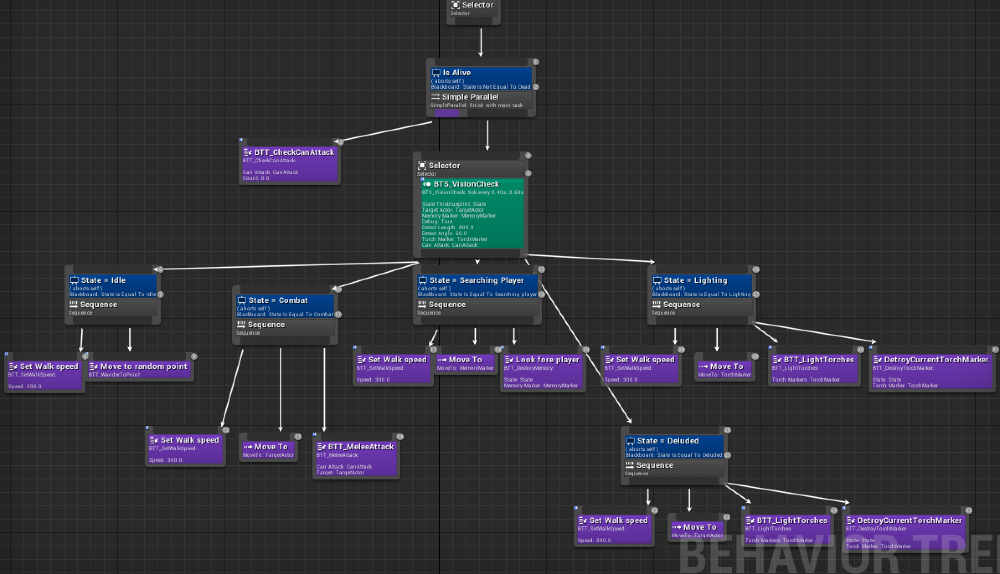

**Hung-Li Chou**

Intro to Game Programming & Intro to Modelling and Animation

Assignment 2: **Modular First Person Game using Unreal Engine**

January 2017

##Gameplay Video
<https://www.youtube.com/watch?v=CZ518R9KwaM&feature=youtu.be>

##Introduction

**Wace** is a stealth game in first person perspective on the platform of PC and consoles. The scene will be built in 3D that provides an immersive gameplay for players. In the game, players act as the main character Wace, aiming to collect all the missing fragments from his flaming heart and escape from the dungeon where he is captivated in.

##Unique Selling Points
1. Interactive environment
2. 3D stealth game
3. Immersive levels
4. Attractive story background
5. Energy (Fire/Light) elements
6. Diverse skills corresponding the key game play mechanics

##Story
**The game** takes place in the world that consists of many tribes or small humanizations, living in the primitive way. A small nation PhotonDominator one day found the mysterious glowing stone, which can constantly generate the light energy, and this makes them being stronger than others. In the beginning, they regarded the magic stone as a gift from the god and used it meticulously. However, after the king’s death, the crown was passed to the savage and ambitious descendant who wants to dominate all the humanizations. He gives an order to employ most of energy for weapons in foray. Due to the depletion of energy, the king casts his greedy eyes on a minority group, Flamer. Flamer people have 2 connected hearts in their body, a normal heart works as the maintenance of life, and a flaming heart which can constantly generate fire, and memorize skills. The Flamer learns how to control fire and skills since they were born.

**One day**, the troops of PhotonDominator invaded a Flamer tribe with advanced laser guns, killing all the civilians to get flaming hearts. But they failed and realized that the body needs to be alive when the heart being taken away from the body to keep it functional. Then, they attempted to intrude another tribe where the protagonist belongs. Both sides lost many people in this fight and PhotonDominator won eventually. All living Flamers were captured by the troops and all flaming hearts were robbed except for a young Flamer, Wace. His special self-defence mechanism was activated in the surgery, breaking the flaming stone to crystals, and scattering all the pieces around the world. Wace and his clansman become normal people and serve as slaves. Only Wace himself knows where the fragments are.

**Wace** aims to save the clansman, and retrieving the clansman’s heart as well as the memory of skills he learned via getting back all the crystals.

##Gameplay Mechanics
The game starts in the **jail scene**, attracting guards, stealing the jail key and sneaking out when the guard is lighting torches. Then, hanging around in the **dungeon** to find fragments while avoiding the guards.

1. **Stealth**: Hiding in corner, rooms and dark places. Using skills to distract and navigate guards.
2. **Stealing**: Stealing weapons (light energy), door key (enter to other places or rooms)
3. **Skills**: In the beginning, the character can only absorb the fire energy, which can also be transformed to become light energy. Finding the fragments of flaming heart can retrieve the memory of different skills. The skills can be divided into 3 categories: Attack (causing damage), Curse (causing temporary dizziness, navigating target to other direction), and Buff (moving speed up)
4. **Energy**: Using skills will deplete fire energy that can be generated automatically but slowly. Absorbing from the torches is the other way to get energy. (Fire and light of the torch disappear after being absorbed). The character can also use weapons found in the game, but this kind of weapons requires light energy, which can be transformed by fire energy.

##Scenes Gameplay
Wace contains **2 scenes** in the first version of the game.

1. **Jail scene**:

	a. You are locked in the jail cell. The only way to get out is to steal the jail key from the guards.

	b. You can unlit torches to attract guards as well as getting fire energy.

	c. Avoid the detection from the guards, or you will be chased and
attacked.
2. **Dungeon**:

	a. There are more guards and traps in the dungeon.

	b. Find all the fragments you lost to regain skills
	
	c. Escape from this dungeon while avoiding being captured by guards.

##AI
All guards are equipped with behaviour tree so they can have different reaction for a variety of situation.

**AICharacter**
This blueprint is derived from the built-in blueprint "Third Person Character". The **AIController** is assigned to this blueprint to run the behaviour tree.

*Behaviour Tree*